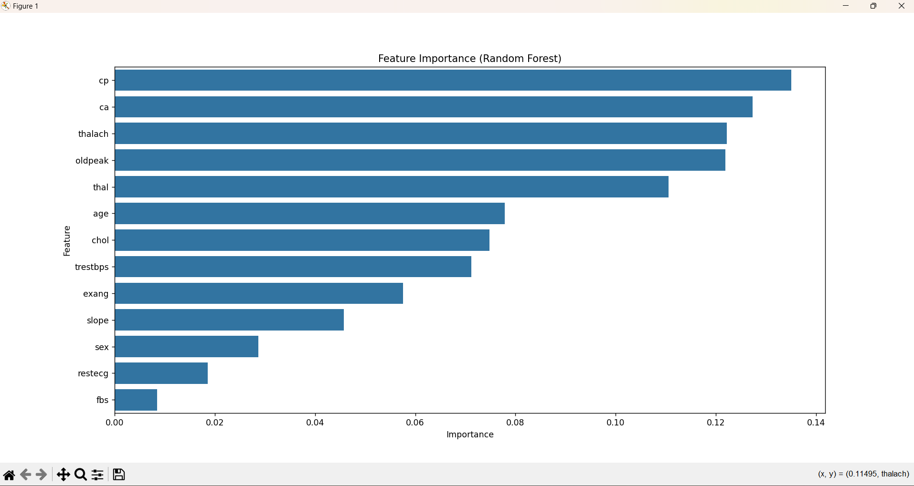

# Heart Disease Prediction using Decision Tree and Random Forest

##  Project Overview
This project uses **Decision Tree** and **Random Forest** classifiers to predict whether a patient is likely to have heart disease based on given features.  
We also visualize the decision tree and show feature importance for the random forest model.

---

## 🛠 Requirements

Make sure you have the following installed:

- Python 3.8+  
- pip (Python package manager)
- Graphviz (for Decision Tree visualization)
- Required Python libraries:
  ```bash
  pip install pandas numpy matplotlib seaborn scikit-learn graphviz
````

---

## ⚙️ Installing Graphviz

Graphviz is required to visualize the decision tree.

### **Windows Installation**

1. Download Graphviz from: [https://graphviz.org/download/](https://graphviz.org/download/)
2. Install it (default options are fine).
3. Add the `bin` folder to your system **PATH**:

   * Example path: `C:\Program Files\Graphviz\bin`
4. Verify installation:

   ```bash
   dot -version
   ```

### **Linux (Ubuntu/Debian)**

```bash
sudo apt-get update
sudo apt-get install graphviz
```

### **MacOS**

```bash
brew install graphviz
```

---

## Dataset
The dataset heart.csv should be placed in the project root folder.

It contains features such as:

age → Age of the patient

chol → Serum cholesterol in mg/dl

trestbps → Resting blood pressure (mm Hg)

thalach → Maximum heart rate achieved

cp → Chest pain type

oldpeak → ST depression induced by exercise relative to rest

ca → Number of major vessels colored by fluoroscopy

thal → Thalassemia type

fbs → Fasting blood sugar (> 120 mg/dl)

restecg → Resting electrocardiographic results

exang → Exercise induced angina

slope → Slope of the peak exercise ST segment

The target variable:

0 → No Heart Disease

1 → Heart Disease
 Dataset Source: Kaggle – Heart Disease Dataset
---

##  Steps Performed

### **1️ Load the Dataset**

```python
df = pd.read_csv("heart.csv")
X = df.drop("target", axis=1)
y = df["target"]
```

### ** 2️ Split Data into Train/Test Sets**

```python
from sklearn.model_selection import train_test_split
X_train, X_test, y_train, y_test = train_test_split(X, y, test_size=0.2, random_state=42)
```

### **3️ Train Decision Tree Classifier**

```python
from sklearn.tree import DecisionTreeClassifier
dt_model = DecisionTreeClassifier(random_state=42)
dt_model.fit(X_train, y_train)
y_pred_dt = dt_model.predict(X_test)
```

Evaluate accuracy:

```python
from sklearn.metrics import accuracy_score
print("Decision Tree Accuracy:", accuracy_score(y_test, y_pred_dt))
```

---

### **4️ Visualize the Decision Tree**

```python
from sklearn.tree import export_graphviz
import graphviz

dot_data = export_graphviz(
    dt_model,
    out_file=None,
    feature_names=X.columns,
    class_names=["No Disease", "Disease"],
    filled=True, rounded=True, special_characters=True
)
graph = graphviz.Source(dot_data)
graph.render("decision_tree")  # Saves as decision_tree.pdf
```

---

### **5️ Limited Depth Decision Tree**

```python
dt_model_limited = DecisionTreeClassifier(max_depth=4, random_state=42)
dt_model_limited.fit(X_train, y_train)
y_pred_limited = dt_model_limited.predict(X_test)
print("Limited Depth Decision Tree Accuracy:", accuracy_score(y_test, y_pred_limited))
```

---

### **6️ Train Random Forest Classifier**

```python
from sklearn.ensemble import RandomForestClassifier
rf_model = RandomForestClassifier(n_estimators=100, random_state=42)
rf_model.fit(X_train, y_train)
y_pred_rf = rf_model.predict(X_test)
print("Random Forest Accuracy:", accuracy_score(y_test, y_pred_rf))
```

---

### **Feature Importance (Random Forest)**

```python
importances = rf_model.feature_importances_
feat_importance_df = pd.DataFrame({
    'Feature': X.columns,
    'Importance': importances
}).sort_values(by='Importance', ascending=False)

print(feat_importance_df)
```

Plot feature importance:

```python
import matplotlib.pyplot as plt
import seaborn as sns

plt.figure(figsize=(8,5))
sns.barplot(x='Importance', y='Feature', data=feat_importance_df)
plt.title("Feature Importance (Random Forest)")
plt.savefig("images/random_forest.png")
plt.show()
```

---

### **8️⃣ Cross Validation**

```python
from sklearn.model_selection import cross_val_score
scores = cross_val_score(rf_model, X, y, cv=5)
print("Cross-validation scores:", scores)
print("Average CV Score:", scores.mean())
```

---

##  Output Example

Decision Tree Accuracy: 0.9853658536585366
Limited Depth Decision Tree Accuracy: 0.8
Random Forest Accuracy: 0.9853658536585366
     Feature  Importance
2         cp    0.135072
11        ca    0.127327
7    thalach    0.122169
9    oldpeak    0.121905
12      thal    0.110518
0        age    0.077908
4       chol    0.074822
3   trestbps    0.071171
8      exang    0.057594
10     slope    0.045782
1        sex    0.028731
6    restecg    0.018557
5        fbs    0.008444
Cross-validation scores: [1.         1.         1.         1.         0.98536585]
Average CV Score: 0.9970731707317073
```

### **Feature Importance Plot**



---

##  Project Structure

```
 heart-disease-prediction
 ├── heart.csv
 ├── main.py
 ├── images/
 │   ├── random_forest.png
 ├── decision_tree.pdf
 ├── README.md
```

---

##  Conclusion

* **Random Forest** gave better accuracy than the Decision Tree.
* **Feature importance** helped identify which factors impact predictions the most.
* Visualizing the decision tree helps understand decision-making steps.

---


```
